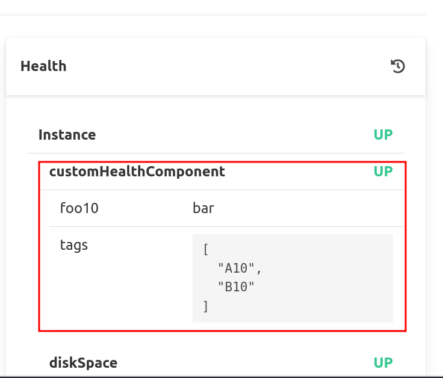

# The issue...

*

*
See [https://github.com/codecentric/spring-boot-admin/issues/2997](https://github.com/codecentric/spring-boot-admin/issues/2997)
**

With Spring Boot Admin Server 2.7.11+ additional health details are missing in event.


Note : health details are still visible on status page. the issue is **only** in the registration event.



# Demo

Start the stack (no need to pre-package maven artefacts, maven artifacts are built by container)

``` bash
docker compose up --build
```

Once started, 2 Spring Boot app (with Spring Boot Admin client) are available :

* [Spring Boot Client 2.7.10](http://localhost:9810)
* [Spring Boot Client 2.7.11](http://localhost:9811)

and 2 Spring Boot Admin server are available :

* [Spring Boot Admin Server 2.7.10](http://localhost:9910)
* [Spring Boot Admin Server 2.7.11](http://localhost:9911)

Both clients register themselves to all servers.

Compare logs of Spring Boot Admin Server `2.7.10` vs `2.7.11`

# Dev

The root `pom.xml` is only used when developing on the test case.

To demonstrate the testcase there is no need to have a maven env, `docker compose` is enough